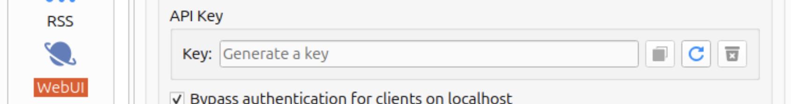

> [!NOTE]
> API key authentication is available starting from qBittorrent v5.2.0 or WebAPI v2.14.1

# Introduction

You can authenticate to the qBittorrent WebAPI using an API key. This allows for stateless authentication without the use of cookies.

Currently, only a single API key is supported. This key can be rotated, which will immediately invalidate the previous key.

## Format

API keys are 32 characters long. They start with the prefix `qbt_` followed by 28 random alphanumeric characters. Each key is generated with 160 bits of entropy.

## Usage

Specify the key in the `Authorization` header using a scheme of `Bearer`. For example: `Authorization: Bearer <API_KEY>`.

## Generate

To generate an API key:

1. Open qBittorrent Preferences
1. Click on WebUI
1. Navigate to the API Key section
1. Click on the Generate icon.

## Limitations

API keys cannot be used to fetch the WebUI or other static assets. They also cannot interact with the WebAPI's auth endpoints, including `login` and `logout`.
